# AVIAN: Blender Simulation and Inspection Film

**AVIAN** is an autonomous bridge-inspection drone, built for **Smart India Hackathon 2026** (problem statement **SIH26201**) by **Team TRINETRA**, **Charotar University of Science & Technology**.

This repository is the **Blender side** of the project: the modelled bridge with seeded defects, the cinematic render pipeline, and a film in which the drone approaches real modelled damage while the trained detector fires on screen. The Gazebo flight simulation lives elsewhere and is not part of this repo.

## Watch

[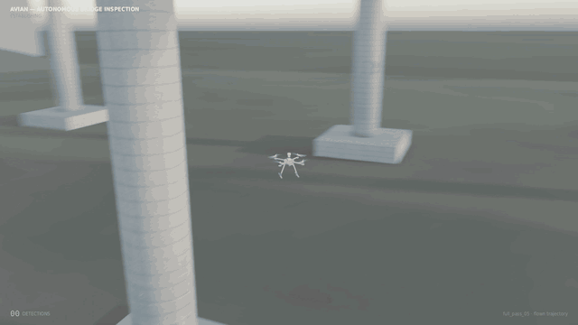](https://drive.google.com/file/d/1JEOL6fjqovZchbOK0rHiGIVGq6CAX5SJ/view?usp=drive_link)

<sub>Looping 9 s preview cut from the finished film (click to open the full film on Google Drive).</sub>

| | Watch online | File in this repo |
|---|---|---|
| **Inspection + detection film** (82.6 s, 1920×1080) | [Google Drive](https://drive.google.com/file/d/1JEOL6fjqovZchbOK0rHiGIVGq6CAX5SJ/view?usp=drive_link) | [`AVIAN_Inspection_Film.mp4`](AVIAN_Inspection_Film.mp4) |
| **Environment walkthrough** (47.9 s) | [Google Drive](https://drive.google.com/file/d/1irq2_L2NseZZHnmWRftRGNXPAeEZk6e7/view?usp=drive_link) | [`media/bridge_defect_walkthrough_cinematic.mp4`](media/bridge_defect_walkthrough_cinematic.mp4) |

**GitHub does not play these mp4 files in the browser** (it says the files are too big to show, and serves the raw file as a download). To watch, use the Google Drive links, or download the file from this repo and play it locally.

The two Drive pages were opened and their titles read: the first link is `avian_inspection_film.mp4` and the second is `bridge_defect_walkthrough_cinematic.mp4`. The contents of the Drive files were not downloaded, so they are labelled from their titles only.

## Gallery

Every still below was extracted from the finished film. Boxes, labels and confidences are drawn from real detector output on the rendered frames.

<table>
<tr><td align="center"><a href="images/01_bridge_overview.jpg">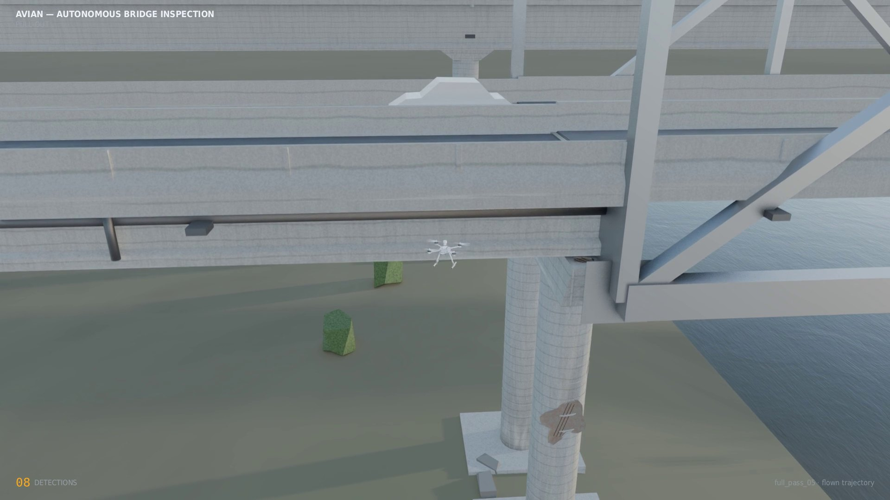</a><br><sub>Pull-out over the bridge: deck, truss, pier and the inspection drone</sub></td><td align="center"><a href="images/02_beat1_spall_007_0.99.jpg">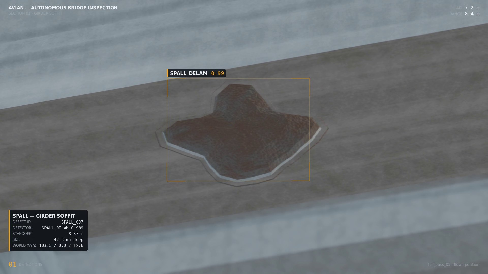</a><br><sub>Beat 1 · SPALL_007 · girder soffit · 0.989</sub></td></tr>
<tr><td align="center"><a href="images/03_beat2_spall_011_0.98.jpg">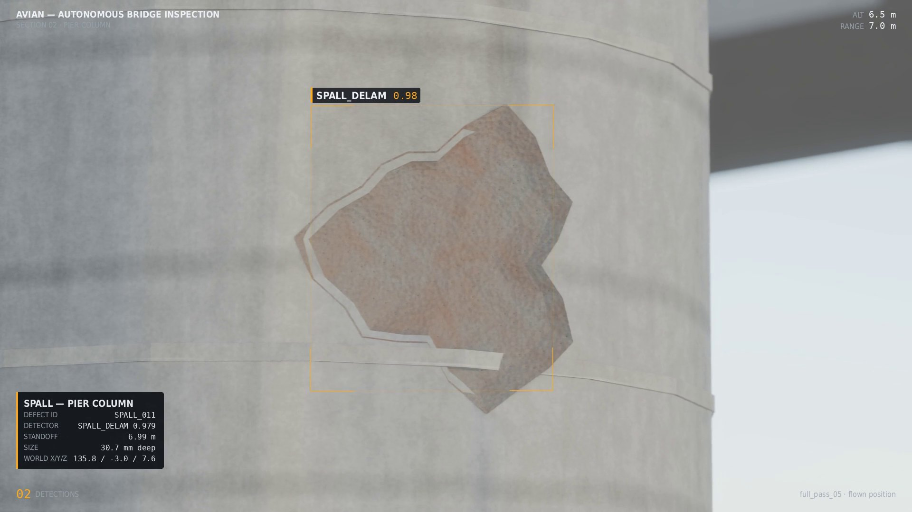</a><br><sub>Beat 2 · SPALL_011 · pier column · 0.979</sub></td><td align="center"><a href="images/04_beat3_spall_009_0.76.jpg">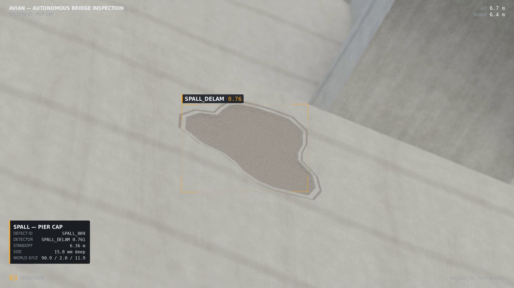</a><br><sub>Beat 3 · SPALL_009 · pier cap · 0.761 (a firing frame; this beat has dropouts)</sub></td></tr>
<tr><td align="center"><a href="images/05_beat4_spall_008_0.94.jpg">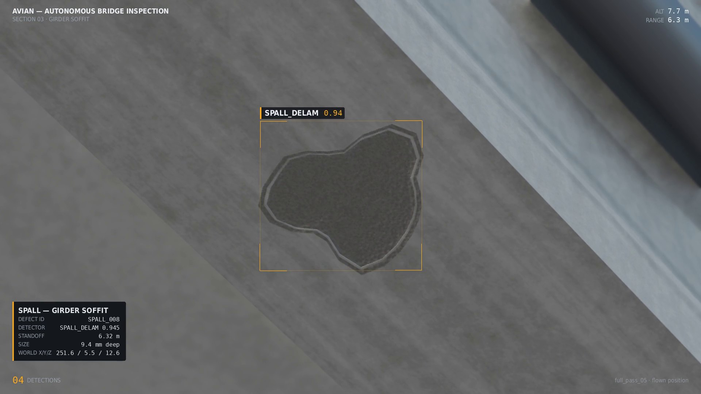</a><br><sub>Beat 4 · SPALL_008 · girder soffit · 0.945</sub></td><td align="center"><a href="images/06_beat5_rebar_exposed_004_0.76.jpg">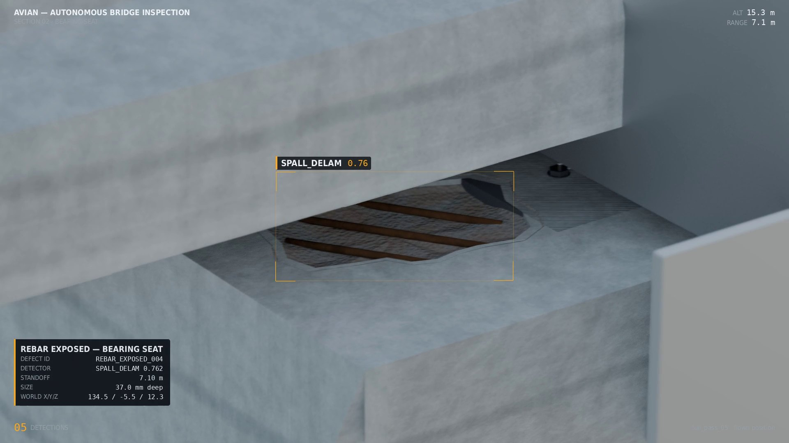</a><br><sub>Beat 5 · REBAR_EXPOSED_004 · bearing seat · 0.762 (a firing frame; this beat has dropouts)</sub></td></tr>
<tr><td align="center"><a href="images/07_beat6_spall_002_0.98.jpg">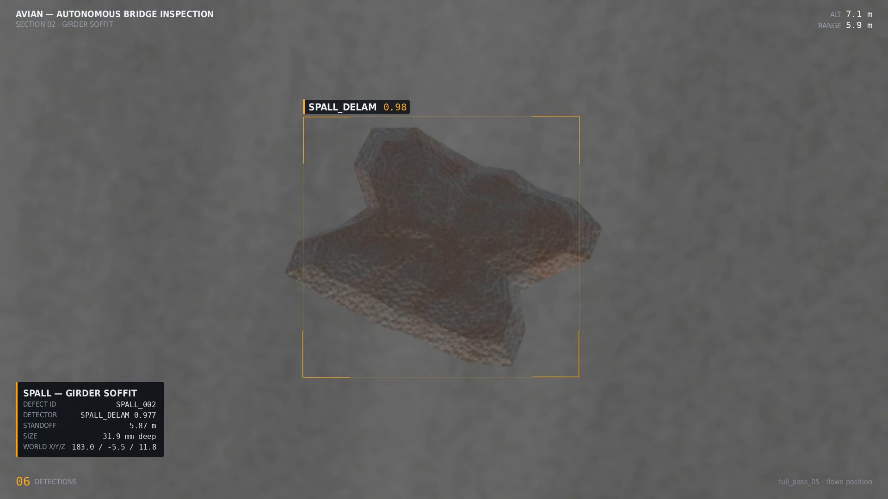</a><br><sub>Beat 6 · SPALL_002 · girder soffit · 0.977</sub></td><td align="center"><a href="images/08_beat7_delamination_001_0.97.jpg">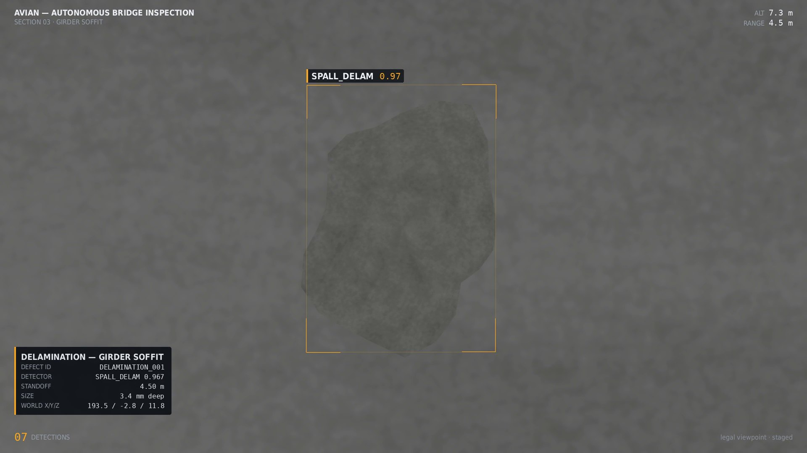</a><br><sub>Beat 7 · DELAMINATION_001 · girder soffit · 0.967 (low-contrast)</sub></td></tr>
<tr><td align="center"><a href="images/09_beat8_rebar_exposed_001_0.99.jpg">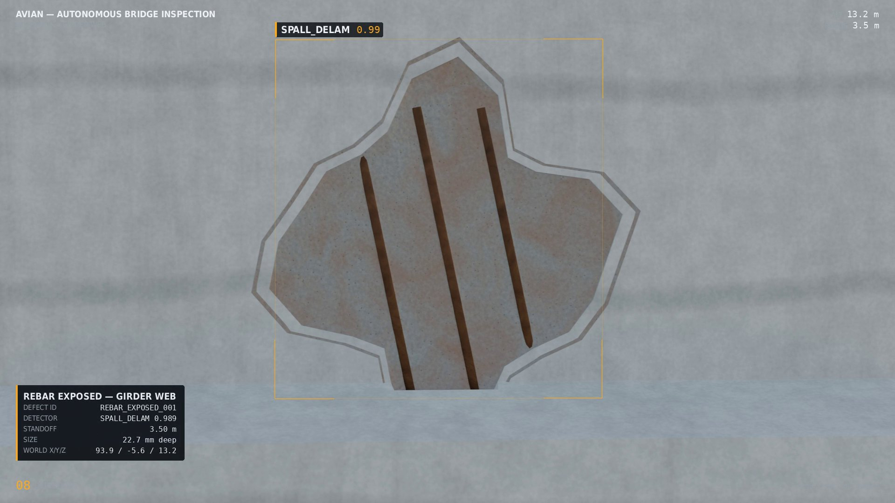</a><br><sub>Beat 8 · REBAR_EXPOSED_001 · girder web · 0.989</sub></td><td align="center"><a href="images/10_drone_establishing.jpg">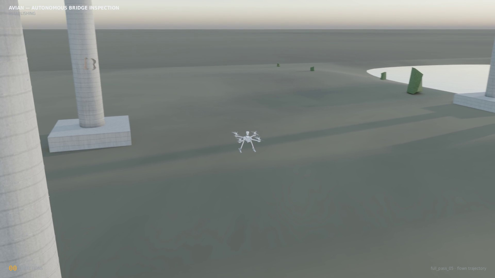</a><br><sub>Chase shot: the drone over the site</sub></td></tr>
<tr><td align="center"><a href="images/11_drone_transit_over_water.jpg">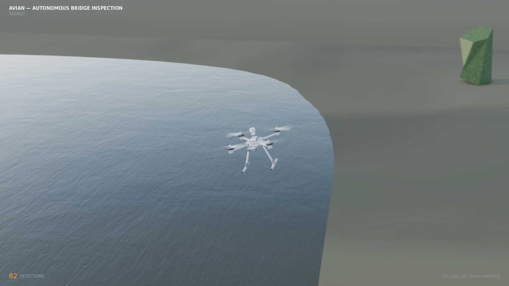</a><br><sub>Chase shot: transit over water</sub></td><td align="center"><a href="images/12_drone_transit_hover.jpg">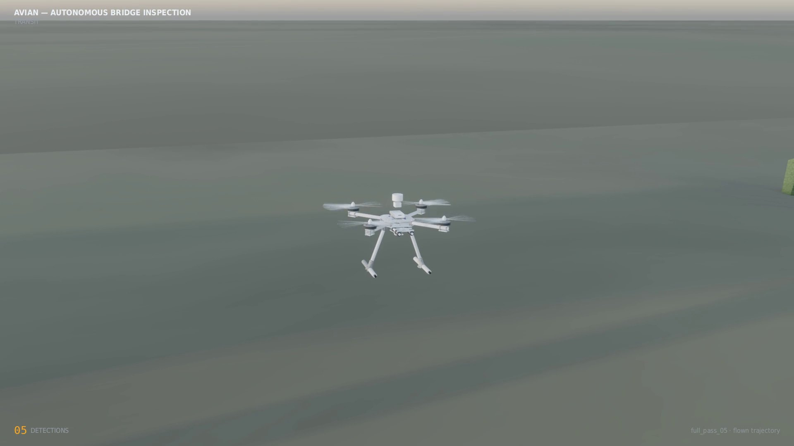</a><br><sub>Chase shot: hovering in transit</sub></td></tr>
<tr><td align="center"><a href="images/13_end_card.jpg">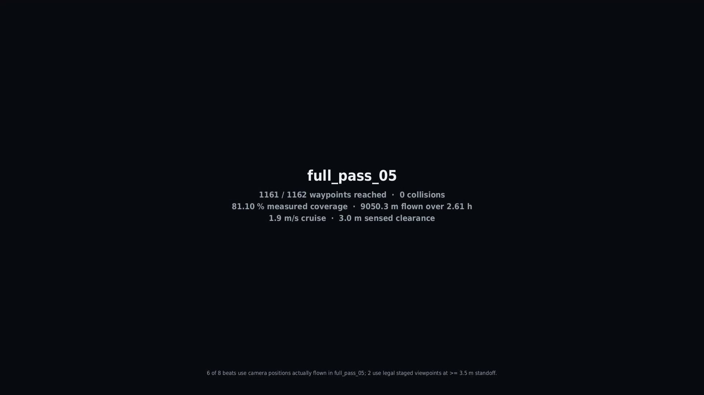</a><br><sub>End card: mission results and provenance of the beats</sub></td><td></td></tr>
</table>

## The eight beats

Each beat approaches one modelled defect, the trained detector fires on the rendered frame, a box and an annotation card appear, and the camera moves on. **Six beats use camera positions the drone actually held in the `full_pass_05` Gazebo mission (with the camera re-aimed and zoomed); two use purpose-built staged viewpoints.**

Confidence is the detector's score on the final rendered frames, taken only over the frames where the box is drawn (median, then min–max). All values come straight from [`scene/film/detection_log.csv`](scene/film/detection_log.csv).

| # | Defect | Surface | Viewpoint | Confidence (median) | min–max | Frames with box | Closest range to defect | Closest camera clearance to any scene geometry |
|---|---|---|---|---|---|---|---|---|
| 1 | `SPALL_007` | Girder soffit | Real flown position | **0.989** | 0.862–0.995 | 144 / 144 | 7.42 m | 4.95 m |
| 2 | `SPALL_011` | Pier column | Real flown position | **0.979** | 0.655–0.986 | 133 / 144 | 6.75 m | 4.68 m |
| 3 | `SPALL_009` | Pier cap | Real flown position | **0.830** | 0.651–0.949 | 104 / 144 | 5.93 m | 3.92 m |
| 4 | `SPALL_008` | Girder soffit | Real flown position | **0.958** | 0.906–0.991 | 144 / 144 | 6.09 m | 5.36 m |
| 5 | `REBAR_EXPOSED_004` | Bearing seat | Real flown position | **0.726** | 0.654–0.824 | 54 / 144 | 5.89 m | 3.62 m |
| 6 | `SPALL_002` | Girder soffit | Real flown position | **0.977** | 0.922–0.993 | 144 / 144 | 5.49 m | 4.40 m |
| 7 | `DELAMINATION_001` | Girder soffit | Staged viewpoint | **0.967** | 0.953–0.971 | 144 / 144 | 4.50 m | 4.47 m |
| 8 | `REBAR_EXPOSED_001` | Girder web | Staged viewpoint | **0.989** | 0.988–0.990 | 144 / 144 | 3.50 m | 2.30 m ⚠️ |

- **Range:** every beat's camera stays at least **3.5 m** from its defect (closest: beat 8, 3.50 m).
- **Camera clearance:** measured with [`scene/film/verify_clearance_film.py`](scene/film/verify_clearance_film.py) as the distance from every camera position to the nearest surface in the scene mesh (raw output: [`clearance_result.json`](scene/film/clearance_result.json)). Seven beats clear 3.5 m. **Beat 8 does not:** its camera is 3.50 m from the defect but only **2.30 m** from the underside edge of `BR_DECK_SLAB_003`, which is inside the 3.0 m mission clearance. See *Known limitations*.
- The detector is the trained `AVIAN_detector_weights_v2` model run at a 0.65 score threshold.

## How the film was made

1. `render_film.py` renders every frame in Blender's EEVEE engine (TAA 16, depth of field, motion blur) with no overlay; the drone is hidden in beat shots.
2. `compose_film.py` runs the **real trained detector on the rendered frames** and then draws only what the detector returned. Boxes are never hand-drawn and no confidence is typed in. Every drawn box is a row in the detection log.
3. `assemble_film.sh` encodes each shot and joins them with ffmpeg `xfade` crossfades (not Blender's sequencer, which double-applies the AgX colour transform).
4. Verification scripts check the result: container and frame count, blend-weight fit of all 13 crossfades, drawn boxes in the decoded film against the log, depth of field and motion blur against renders with each effect disabled, and camera clearance.

Verified on the final file: 1982 frames, 82.583 s, 1920×1080, 24 fps, no decode errors; 13 of 13 crossfades present; 908 of 941 drawn frames show brackets at the logged position and none of the 427 undrawn frames do (the 33 misses are fade-in/out frames); motion blur measurably present; depth of field measurably present on beat 4.

## Known limitations

- **Beat 8 camera clearance.** The staged viewpoint for `REBAR_EXPOSED_001` keeps the camera 3.50 m from the defect, but its nearest scene geometry is a deck-slab edge at **2.30 m** (see the table). It does not meet a 3.5 m clearance, or the 3.0 m safety ring.
- **Beats 3 and 5 have detector dropouts.** The detector fires intermittently on these two, so their boxes flicker: beat 3 has no detection on 40 of the 144 frames after acquisition (longest gap 29 frames, 1.2 s); beat 5 has none on 90 of 144 (longest gap 70 frames, 2.9 s), and its annotation card shows only briefly. Boxes are not held across gaps, because that would draw a box the detector did not produce.
- **Beat 7's delamination is low-contrast.** The detector finds it at 0.967, but the patch is hard to see by eye against the grey soffit.
- **HUD secondary text washes out on bright frames.** The ALT/RANGE labels, the section subtitle and the "flown position / staged" tag are faint or invisible on bright backgrounds (notably beats 1, 3, 5 and 8).
- **One detector class for three defect types.** The detector reports `SPALL_DELAM` for spalls, delaminations and exposed rebar because they share one family in `labels_final.json`. The annotation card shows the specific defect type from the ground truth; the detector label does not distinguish them.
- **Depth of field on beat 8.** DoF is clearly present in the file on beat 4, but at beat 8's range the effect is at the codec noise floor, so it could not be demonstrated there.
- **End card wording.** The end card's "3.0 m sensed clearance" is the Gazebo mission's own figure; it is not this film's camera clearance.

## Repository layout

```
AVIAN_Inspection_Film.mp4            headline deliverable
images/                              13 stills from the film
media/bridge_defect_walkthrough_cinematic.mp4
scene/SIH_AVIAN_FINAL.blend          the bridge scene (about 37 MB)
scene/film/                          inspection-film pipeline, shot list, detection log (CSV + JSON)
scene/cine/                          environment-walkthrough pipeline
scene/make_flythrough.py
```

## Reproducing

The scripts use absolute paths from the machine they were written on (a hard-coded project root, and a PX4-Autopilot checkout for the x500 meshes); change `ROOT`/`SRC` at the top of each script. Re-rendering also needs files that are **not** in this repo: the trained detector weights (`detection/AVIAN_detector_weights_v2_FINAL.pt`), `dataset/labels_final.json`, the ground-truth defect JSON and the `full_pass_05` pose track. The rendered frames (about 7 GB) are not included; the finished film and the detection log are.

Requires Blender 4.0.2 (EEVEE; `BLENDER_EEVEE_NEXT` does not exist in 4.0.2 and silently falls back to Cycles), ffmpeg, and PyTorch/torchvision for the detector.
